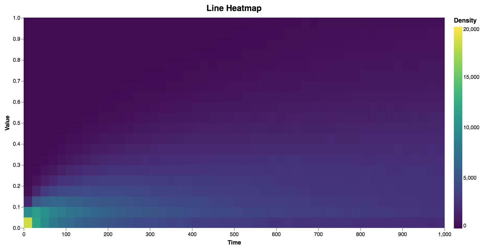

# Fast density heatmaps for time series with WebGL

Try the demo at https://domoritz.github.io/line-heatmap.

This implementation renders as many lines a possible into a single framebuffer and computes the sums and normalization entirely on the GPU. The multiple heatmaps are eventually collected into a single output buffer. We can then render the buffer with the tool of our choice (e.g. Vega).

</img>

## Related repos

https://github.com/domoritz/line-density-rust for a parallel Rust implementation.

## Resources

- http://regl.party/api
- https://github.com/Erkaman/regl-cnn/blob/gh-pages/src/gpu.js
- https://github.com/realazthat/glsl-sat
- https://github.com/regl-project/regl/blob/gh-pages/example/graph.js
- https://beta.observablehq.com/@tmcw/game-of-life-with-regl
